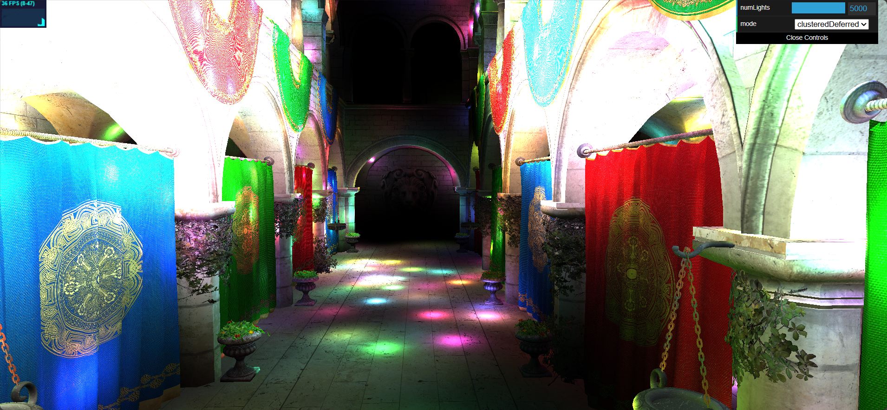
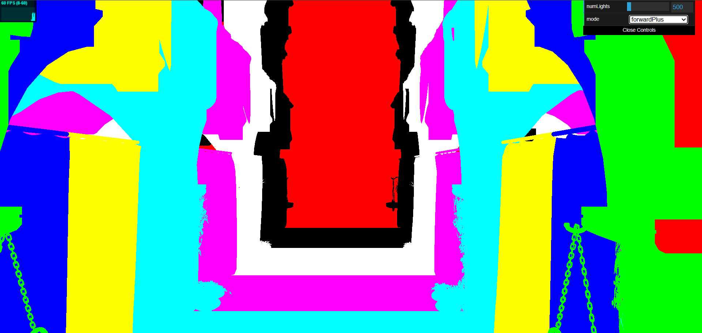
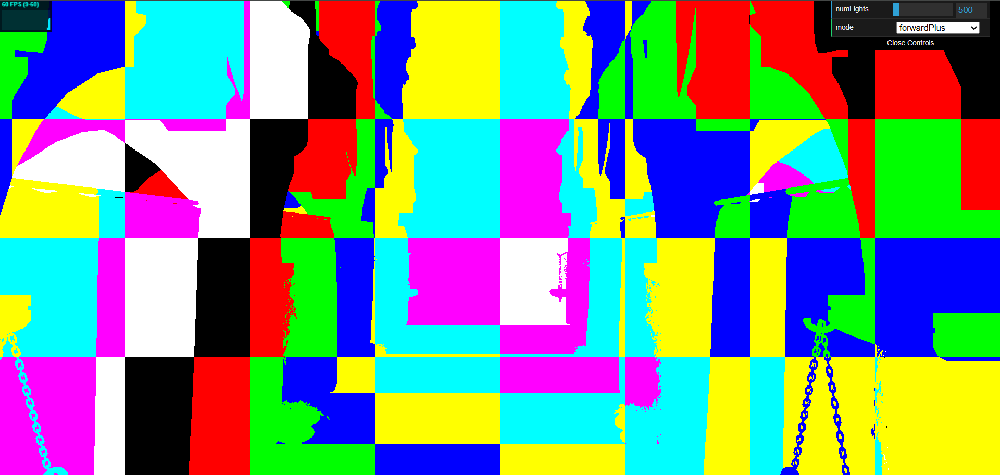
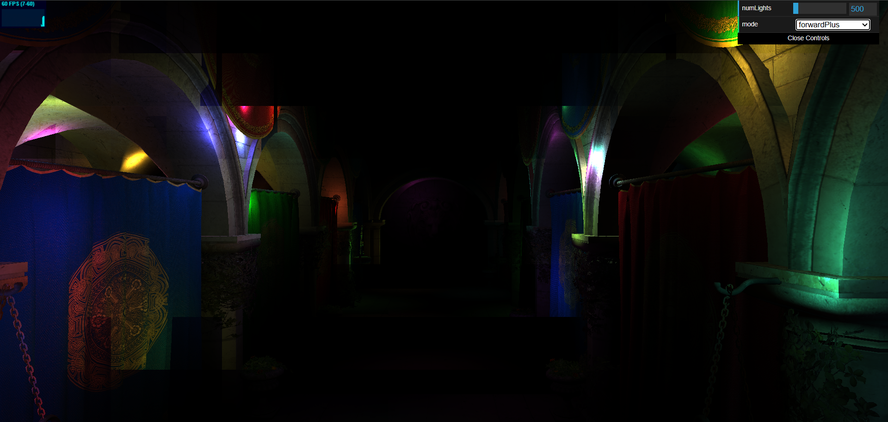

WebGL Forward+ and Clustered Deferred Shading
======================

**University of Pennsylvania, CIS 565: GPU Programming and Architecture, Project 4**

* Hongyi Ding
  * [LinkedIn](https://www.linkedin.com/in/hongyi-ding/), [personal website](https://johnnyding.com/)
* Tested on: Windows 11, Intel(R) Core(TM) Ultra 7 155H @ 3800MHz 16GB, (SEAS Virtual Lab), Intel(R) Arc(TM) Graphics

### Live Demo

Please check out the live demo here: [cool and awesome renderer](https://johnnysist.github.io/Project4-WebGPU-Forward-Plus-and-Clustered-Deferred/)

This project supports three rendering modes: Naive, Forward+, and Clustered Deferred. You can freely switch between them in the UI:

- **Naive**: Each pixel computes lighting by iterating over all lights in the scene. This is simple and suitable for small scenes or debugging, but not efficient for many lights.
- **Forward+**: The screen is divided into clusters, and each cluster only considers the lights that affect it. This greatly improves performance in large scenes with many lights.
- **Deferred**: Scene information is first written to a G-buffer, then lighting is computed in a fullscreen pass using clustered light data. The performance is further improved by skipping shading for unseen fragments.

### Demo Video/GIF

[Demo Video for CIS5650 Project4 WebGPU Forward+ and Clustered Deferred Shading](https://www.youtube.com/watch?v=lMRdrulaMXU)

### Naive Forward Rendering

Naive rendering is the simplest rendering model. We iterate each geometry and pass them into the fragment shader. The fragment shader computes the shading for each fragment, and then do depth test. It is simple and straitforward, however, there are some drawbacks:
- Inefficient for scenes with many lights, as we need to iterate over all lights for each fragment, leading to high computational cost. But for point lights, it has a limited range, so it's not necessary to consider all lights.
- The shading for unseen fragments is still computed, wasting computational resources. This can be solved by deferred rendering techniques.

### Forward+ Rendering

We implemented the Forward+ by splitting the view frustum into a 3D grid of clusters. Before computing lighting in the rendering pass, we determine which lights affect each cluster by checking the intersection between the light's bounding sphere and the cluster's bounding box. The information is calculated by a compute shader in GPU, and later used in the fragment shader to only consider relevant lights for shading, improving performance significantly in scenes with many lights.

To computer the cluster index of a fragment, we use the following formula:

$$
\begin{aligned}
Index_x = \left\lfloor \frac{NDC_x + 1}{2} \cdot dim_x \right\rfloor\\
Index_y = \left\lfloor \frac{NDC_y + 1}{2} \cdot dim_y \right\rfloor\\
Index_z = \left\lfloor \frac{\log\frac{-View_z}{zNear}}{\log\frac{zFar}{zNear}} \cdot dim_z \right\rfloor
\end{aligned}
$$

where $Index$ is the cluster index we want to know, $NDC$ is the normalized device coordinate of the fragment, $View_z$ is the view space z coordinate of the fragment, $zNear$ and $zFar$ are the near and far plane distances, and $dim$ is the dimension of the cluster grid.

### Deferred Rendering

In the Deferred rendering mode, we first render the scene geometry into a G-buffer that stores the necessary information for shading, including position, normal and color. Then in a fullscreen lighting pass, we compute the lighting for each pixel using the clustered light data. This approach allows us to skip shading for fragments that are not visible in the final image, further improving performance.

### Performance Analysis

The following table shows the performance (in fps) for different rendering methods under different light numbers:

| Number of Lights | Naive | Forward+ | Clustered Deferred |
| ---------------- | ----- | -------- | ------------------ |
| 500              | 9     | 60+      | 60+                |
| 1000             | 5     | 52       | 60+                |
| 2000             | 2     | 31       | 57                 |
| 3000             | <1    | 19       | 47                 |
| 4000             | <1    | 17       | 44                 |
| 5000             | <1    | 12       | 36                 |

Compare your implementations of Forward+ and Clustered Deferred shading and analyze their differences.

- Is one of them faster?

  Yes. Clustered Deferred is faster, as it adopts 2 improvements methods.

- Is one of them better at certain types of workloads?

  They are both optimized for scenes with many lights. And Clustered Deferred shading is also optimized for complex scenes, where there are many occlusions and objects are blocking each other from the camera's view.

- What are the benefits and tradeoffs of using one over the other?

  Cluster Deferred rendering requires more buffer space, so it takes more memory access time. The benefits are that many shading are skipped for fragments that cannot be seen. The Drawbacks is that it might not work for scenes with a lot of transparency objects. Objects with transparency might be directly skipped or rendered as opaque material.

- For any differences in performance, briefly explain what may be causing the difference.

  The main difference comes from the rendering of unseen objects. For Forward+ rendering, even if the depth test might fail, the unseen fragments are still rendered. Thus the lighting computation is still done in the fragment shader. However in the Deferred rendering, these fragments are skipped, thus much computation are reduced.

The following is a brief comparison of performance under different cluster grid dimensions, where number of lights is set to 3000:

| Dimension (X, Y, Z) | Framerate |
| ------------------- | --------- |
| 16, 8, 4            | 12        |
| 16, 8, 8            | 23        |
| 16, 8, 16           | 37        |
| 16, 8, 24           | 32        |
| 16, 8, 32           | 34        |
| 2, 2, 32            | 36        |
| 4, 4, 32            | 32        |
| 8, 8, 32            | 48        |
| 12, 12, 32          | 51        |

As we can see from the table, the number of slices along z-axis has the greatest impact on the performance. The larger z dimension is, the better performance we have. This is because the scene is more subtly divided into clusters. However, tuning up dimensions also have drawbacks. We will require larger buffer space and more preprocessing of cluster data, which can also slow down the application. So, we adopt a default dimension of `(16, 8, 32)`, which seems to be an appropriate size on my device.

### Debugging

This is a visualization of the clustering division along the z-axis:

This is a visualization of the clustering division in the 3D space:

This is a debugging problem when I tried to implement the clustering in forward+ rendering. This error happened because the cluster index was not calculated correctly. In the preprocessing pass, the index was based on the xy coordinates in the view space. But in the fragment shader, the index was calculated by the screen coordinates. They have different directions, so the AABB was not correctly generated for each cluster. The AABBs was kind of reverted over the whole frustum.

At last, the bug was fixed by replacing the indexing in the fragment shader. The index was based on the NDC coordinates instead, which aligns with the view space.

### Credits

- [Vite](https://vitejs.dev/)
- [loaders.gl](https://loaders.gl/)
- [dat.GUI](https://github.com/dataarts/dat.gui)
- [stats.js](https://github.com/mrdoob/stats.js)
- [wgpu-matrix](https://github.com/greggman/wgpu-matrix)
- [A Primer On Efficient Rendering Algorithms & Clustered Shading.](https://www.aortiz.me/2018/12/21/CG.html)

